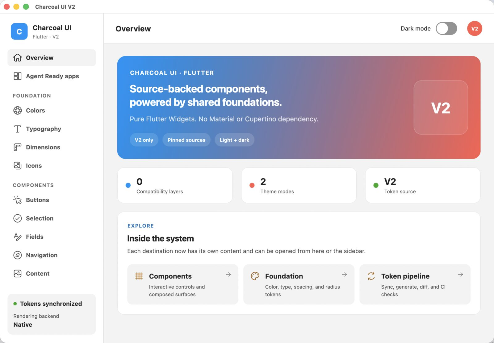

# Charcoal UI for Flutter

An independent Charcoal V2 UI library implemented directly on Flutter's Widgets layer. It does not
depend on Material or Cupertino. The package combines generated Charcoal foundations with
source-backed Flutter components, light and dark themes, accessibility behavior, and reproducible
drift checks.

**Agent Ready by design.** Charcoal ships a version-matched page-design Skill, generated API and
token Catalog, CLI/MCP discovery, Widget Preview workflow, and app-wide review gates so coding
agents can discover, compose, and verify the exact installed UI version instead of guessing.
[Install the required agent integration](#required-install-the-agent-integration) before using an
agent to design or implement product UI.



This project is V2-only. It intentionally contains no Charcoal V1 aliases or compatibility API.

Explore the [Charcoal UI V2 Showcase](https://kevinzhow.github.io/charcoal-flutter/) in a browser.

## Packages

- `packages/charcoal_tokens`: generated color, dimension, and typography foundations.
- `packages/charcoal_icons`: the generated Charcoal Icons V2 SVG catalog and Flutter widget.
- `packages/charcoal_ui`: independent Widgets-layer components, themes, and interaction primitives.
- `packages/charcoal_catalog`: versioned component API, usage guidance, and executable examples.
- `packages/charcoal_cli`: deterministic discovery, diagnostics, and agent-instruction setup.
- `packages/charcoal_mcp`: read-only MCP adapter over the same component and token Catalog.
- `example`: the exhaustive Showcase used for visual development and regression checks.
- `agent`: versioned agent-readiness benchmark prompts and scoring contract.
- `tool/tokens.dart`: pinned token sync, validation, generation, semantic diff, and drift checking.
- `tool/icons.dart`: pinned icon sync, validation, generation, and drift checking.
- `tokens/upstream`: the original V2 token JSON pinned to an exact upstream commit.

Public components include:

- `CharcoalApp`, `CharcoalTheme`, `CharcoalThemeData`, `CharcoalMotion`, and `CharcoalPageRoute`
- `CharcoalButton`, `CharcoalLinkButton`, `CharcoalSwitchingButton`, and `CharcoalIconButton`
- `CharcoalCheckbox`, `CharcoalMultiSelect`, `CharcoalRadio`, and `CharcoalSwitch`
- `CharcoalFieldLabel`, `CharcoalTextField`, `CharcoalTextArea`, and `CharcoalDropdown`
- `CharcoalSegmentedControl`, `CharcoalPagination`, `CharcoalCarousel`, `CharcoalTabBar`, and `CharcoalNavigationItem`
- `CharcoalTagItem`, `CharcoalHintText`, `CharcoalTextEllipsis`, and loading surfaces
- tooltip, balloon, toast, snackbar, and modal surfaces and presentation APIs
- `CharcoalTypography`, `charcoalTypographyStyle`, and `CharcoalTextStyles`

The API follows Flutter conventions instead of reproducing another platform's view hierarchy.
Icon-bearing controls accept regular widgets; applications can use `charcoal_icons` or inject
product-specific artwork without coupling the two packages.

`charcoal_ui` does not bundle font files. Apple native targets map the default typography to their
system text and display families; Web and other native targets defer to Flutter's renderer default.
Applications that need stable Web metrics or a brand font can bundle a renderer-supported asset and
override the generated font-family token through `CharcoalThemeData`. The Showcase demonstrates
that approach with a self-hosted Google Fonts Noto Sans WOFF2 asset on Web.

## Architecture

Component layout follows a four-stage relationship:

```text
Primitive JSON
  space.10 = 4, space.20 = 8, space.25 = 12, space.30 = 16
        ↓ reference resolution
Semantic foundation
  space.component/10, space.component/20, space.layout/30, space.target/s
        ↓ component-owned mapping
Private component specification
  button.iconGap, textArea.fieldGap, dialog.pageInset
        ↓
Flutter Widgets implementation
```

Colors, font families and weights, standard spacing, target sizes, radii, and border widths use the
generated semantic foundation when an exact role exists. Measurements specific to one upstream
implementation—such as the 51 × 31 switch track, 9 px text-area inset, or 3 px tooltip arrow—remain
private constants beside that component. Values are never forced onto a nearby token merely to
remove a literal.

`CharcoalThemeData` contains only foundations: brightness, colors, dimensions, and typography.
Component geometry and behavior are not a public theme surface or a generated configuration file.

Component behavior is audited against two pinned sources:

1. A public SwiftUI implementation is the primary reference when one exists:
   [`pixiv/charcoal-ios@8d96f2c`](https://github.com/pixiv/charcoal-ios/tree/8d96f2cef5be9e7983898e13cf45e0222f1aadda/Sources/CharcoalSwiftUI/Components).
2. Otherwise the corresponding Charcoal implementation is used:
   [`pixiv/charcoal@08995fa`](https://github.com/pixiv/charcoal/tree/08995fa5191fa918fc5afd2c5da08490ae307da7/packages/react/src/components).
3. Flutter adds keyboard, pointer, semantics, text-scaling, reduced-motion, and viewport adaptations.

Source provenance is an implementation concern. Public component names remain platform-neutral so
components can mature without API renaming.

See [Component source contracts](docs/component-sources.md) for the complete source matrix and
verified measurements.

## Usage

```dart
import 'package:charcoal_ui/charcoal_ui.dart';
import 'package:flutter/widgets.dart';

void main() {
  runApp(
    CharcoalApp(
      home: Center(
        child: CharcoalButton(
          variant: CharcoalButtonVariant.primary,
          onPressed: () {},
          child: const Text('Create'),
        ),
      ),
    ),
  );
}
```

Import the icon package independently when composing icon-bearing controls:

```dart
import 'package:charcoal_icons/charcoal_icons.dart';

CharcoalIconButton(
  icon: const CharcoalIcon(CharcoalIcons.add),
  onPressed: () {},
  semanticLabel: 'Create',
);
```

Semantic overrides propagate through every component that consumes that foundation role:

```dart
final baseColors = CharcoalGeneratedColorTokens.light;
final baseDimensions = CharcoalGeneratedDimensionTokens.light;

final theme = CharcoalThemeData.light(
  colors: baseColors.copyWith(
    containerPrimaryDefault: const Color(0xFF9C27B0),
  ),
  dimensions: baseDimensions.copyWith(
    space: baseDimensions.space.copyWith(
      targetS: 36,
      component30: 20,
    ),
  ),
);

CharcoalTheme(data: theme, child: const MyScreen());
```

## Agent Ready

### Required: install the agent integration

Agent Ready starts by installing the version-matched `charcoal-page-design` Skill and managed
instructions into the consuming project. This step is required: the CLI and MCP tools below can
expose data, but they do not install the design workflow into a coding agent.

From a Flutter project that declares the matching `charcoal_cli` as a dev dependency, run:

```bash
dart run charcoal_cli:charcoal agent install --agent auto
dart run charcoal_cli:charcoal doctor
```

Project scope is the default. `--agent auto` installs into the detected agent, `--agent all`
targets Codex, Claude, and Cursor together, and `--scope user` installs a personal copy instead.
The installer owns only the versioned Skill directory and managed instruction block; unrelated
project instructions are preserved.

After upgrading Charcoal UI and `charcoal_cli`, synchronize the installed integration and verify
that its Skill, Catalog, package version, and instructions still match:

```bash
dart run charcoal_cli:charcoal agent sync --agent auto
dart run charcoal_cli:charcoal doctor
```

`init` remains available for instruction-only bootstrap, but it does not install the Skill and is
not a substitute for `agent install`.

### Supporting CLI and MCP tooling

The installed Skill is the normative design and review workflow. The CLI and MCP server are
supporting interfaces that let agents and humans discover exact APIs, select semantic tokens,
persist design decisions, and run repeatable verification against the installed package version.

The Catalog is generated from the real exported Dart API and generated token sources. Every
discovered public Widget receives constructor data and source documentation; reviewed components
additionally include use/avoid guidance, accessibility and responsive rules, token roles, related
components, and source copied from a compiling example. Semantic and primitive tokens are labeled
separately and include their exact Dart accessors and resolved light/dark values. Coverage is
reported explicitly so tools never mistake partial guidance for a complete contract.

```bash
# Find a component or reviewed composition from product intent.
dart run charcoal_cli:charcoal search "single choice"
dart run charcoal_cli:charcoal pattern "searchable collection"

# Read the design rules, exact component API, or semantic token accessor.
dart run charcoal_cli:charcoal design-rules --json
dart run charcoal_cli:charcoal component CharcoalSegmentedControl
dart run charcoal_cli:charcoal token "layout spacing" --kind dimension

# Use stable JSON envelopes for automation.
dart run charcoal_cli:charcoal manifest --json

# Persist and validate decisions for a substantial page.
dart run charcoal_cli:charcoal page-spec \
  --output design/my-page.json --page-id my-page --title "My page"
dart run charcoal_cli:charcoal page-spec --validate design/my-page.json

# Inventory every app surface and validate the final Agent Ready review.
dart run charcoal_cli:charcoal app-review \
  --output design/my-app.json --app-id my-app --title "My app"
dart run charcoal_cli:charcoal app-review --validate design/my-app.json

# Validate or benchmark recorded Agent Ready evidence.
dart run charcoal_cli:charcoal benchmark --results path/to/results.json
```

For protocol clients, `charcoal_mcp` exposes the same design rules, patterns, component search,
token, example, and status data through a read-only stdio server. These repository commands run
the CLI and MCP packages directly from source:

```bash
fvm dart run packages/charcoal_cli/bin/charcoal.dart doctor
fvm dart run packages/charcoal_mcp/bin/charcoal_mcp.dart
```

### Maintainer synchronization

After changing a public component API or curated example, regenerate and verify every derivable
Agent Ready artifact:

```bash
fvm dart run tool/agent_ready.dart generate
fvm dart run tool/agent_ready.dart check
```

This single pipeline regenerates the Catalog, derives the distributable Skill bundle, validates
every checked-in Page Experience Spec and App Experience Review, and synchronizes benchmark
versions, managed contributor instructions, and the Codex grader schema. The CLI and MCP server
remain adapters over the Catalog rather than separate documentation sources. Executable examples
remain ordinary Flutter code; they are reference compositions rather than a runtime recipe layer.
See [Agent readiness](agent/README.md) for the benchmark, evidence schema, and rubric.

## Motion and navigation

`CharcoalApp` uses `CharcoalPageRoute` as its default route factory. The route remains opaque,
disables route snapshotting, and honors reduced motion. Horizontal routes install a native-only,
RTL-aware leading-edge pop gesture on iOS. On Android they consume predictive-back start, update,
cancel, and commit events so the destination is visible before the stack changes. Web and desktop
retain Charcoal shared-axis motion without installing mobile edge gestures.

Push an explicit route when using imperative navigation:

```dart
Navigator.of(context).push<void>(
  CharcoalPageRoute<void>(builder: (_) => const DetailPage()),
);
```

Use `PopScope.canPop` for guarded pages so gesture eligibility is known before input begins.
Fullscreen dialogs and vertical iOS routes intentionally do not expose the horizontal edge gesture.
Android host applications must also follow Flutter's platform setup for
[predictive back](https://docs.flutter.dev/platform-integration/android/predictive-back) and set
`android:enableOnBackInvokedCallback="true"` on the Android application or activity.

`CharcoalMotion` exposes shared composition curves. Component-specific durations stay beside the
component whose source contract defines them.

## Updating V2 tokens

```bash
# Resolve a tag, branch, or commit to an exact SHA, then download and validate V2 JSON.
fvm dart run tool/tokens.dart sync --ref main

# Generate strongly typed color, dimension, and typography foundations offline.
fvm dart run tool/tokens.dart generate

# Sync, generate, and write tokens/diff.md for an update pull request.
fvm dart run tool/tokens.dart update --ref main

# Check source hashes, the resolved snapshot, and all generated artifacts.
fvm dart run tool/tokens.dart check

# Compare current sources with the committed semantic snapshot.
fvm dart run tool/tokens.dart diff
```

Generation fails for missing or circular references, mismatched light/dark keys, invalid values,
identifier collisions, manifest drift, or non-reproducible output. Component-only changes are made
in component source and verified by component tests; they do not run through token generation.

Do not edit generated Dart files. Move the pinned upstream revision with `sync` or `update`, then
regenerate. Generated foundation groups expose typed `entries` catalogs so documentation and the
Showcase never maintain a second token inventory.

See [V2 token pipeline](docs/token-pipeline.md) for the full source-of-truth and CI model.

## Updating V2 icons

```bash
fvm dart run tool/icons.dart update --ref main
fvm dart run tool/icons.dart check
```

Token sync metadata lives in `tokens/manifest.json`; icon sync metadata lives in
`icons/manifest.json`. Both record exact upstream commits and source hashes.

The token and icon compilers are standalone deterministic generators because their inputs are
pinned external JSON/SVG assets rather than annotations on consumer Dart libraries. Generated
values pass through a shared Dart-literal encoder and a pinned `dart format` contract; drift checks
regenerate into temporary files and compare exact bytes before CI accepts a change.

## Development and previews

```bash
fvm flutter pub get
fvm flutter analyze
fvm dart test
fvm dart test packages/charcoal_catalog
fvm dart test packages/charcoal_cli
fvm dart test packages/charcoal_mcp
fvm flutter test packages/charcoal_ui/test example/test
fvm dart run tool/tokens.dart check
fvm dart run tool/agent_ready.dart check

cd packages/charcoal_ui
fvm flutter widget-preview start

# In another terminal, preview shared compositions and real page states.
cd ../../example
fvm flutter widget-preview start
```

### Preview one widget

Start only the package that owns the target, then filter inside Flutter Widget Previewer. The
installed Flutter CLI does not provide a `--preview <name>` launch flag.

- For a public Charcoal component, start the Previewer from `packages/charcoal_ui`, then enter the
  exact annotation name in **Search previews**. For example, search `Text fields` for the
  `@CharcoalComponentPreview(name: 'Text fields')` target.
- For an Agent Ready shared composition or page state, start it from `example`, then search its
  exact target name, such as `Daylight habit states` or `Profile · Standard`.
- In VS Code, Android Studio, or IntelliJ, open the exact preview source file and enable
  **Filter previews by selected file**. If that file contains several targets, also use
  **Search previews** to retain only the one being reviewed.

One target may intentionally expand into light/dark or standard/compact cards. Use the restart
button on that preview card to reset only its local state; use global restart only after changing
shared initialization. Preview definitions live in `packages/charcoal_ui/lib/src/previews/` and
the `previews/` directories below `example/lib/agent_examples/`.

Use five gates: complete surface inventory, reusable component previews, deterministic page-state
previews, integrated runtime, and an app-wide final review. Nook, Lumen, and Daylight previews use
their production widgets and ViewModels at 390×844 and 320×700 rather than maintaining preview-only
copies. Their checked-in App Experience Reviews prove that secondary destinations such as Profile
receive the same seven-rule review as the primary flow. See the
[Widget Preview workflow](docs/widget-preview-workflow.md).

Every push to `main` builds the Showcase for the `/charcoal-flutter/` base path and deploys it to
GitHub Pages. The package uses local workspace dependencies and is currently `publish_to: none`.

## Origin and license

Foundation tokens and component behavior come from pixiv's
[charcoal](https://github.com/pixiv/charcoal) and
[charcoal-ios](https://github.com/pixiv/charcoal-ios). This project and both upstream projects use
Apache-2.0. See `NOTICE` for attribution.
